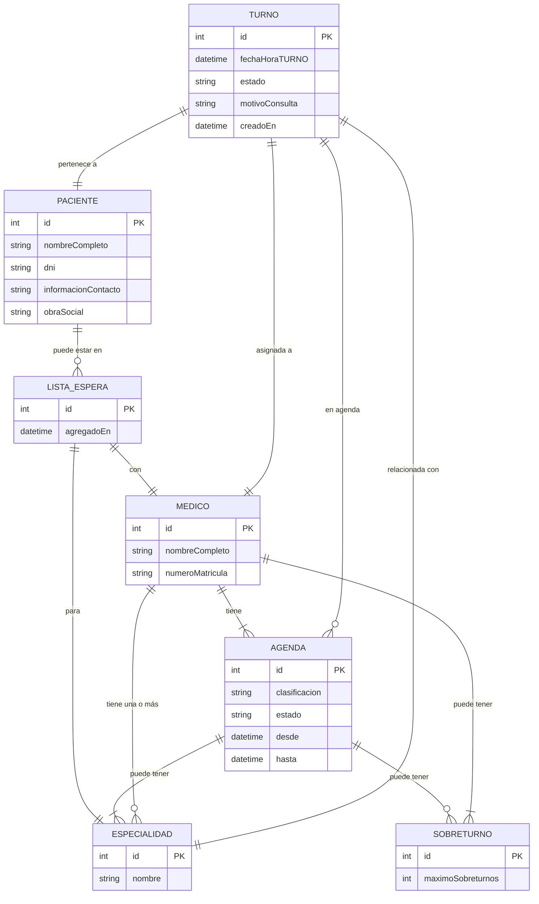

```mermaid
erDiagram
    PACIENTE {
        int id PK
        string nombreCompleto
        string dni
        string informacionContacto
        string obraSocial
    }

    MEDICO {
        int id PK
        string nombreCompleto
        string numeroMatricula
    }

    ESPECIALIDAD {
        int id PK
        string nombre
    }

    TURNO {
        int id PK
        datetime fechaHoraTURNO
        string estado
        string motivoConsulta
        datetime creadoEn
    }

    LISTA_ESPERA {
        int id PK
        datetime agregadoEn
    }

    AGENDA {
        int id PK
        string clasificacion
        string estado
        datetime desde
        datetime hasta
    }

    SOBRETURNO {
        int id PK
        int maximoSobreturnos
    }

    TURNO ||--|| PACIENTE : "pertenece a"
    TURNO ||--|| MEDICO : "asignada a"
    TURNO ||--|| ESPECIALIDAD : "relacionada con"
    TURNO ||--o{ AGENDA : "en agenda"

    MEDICO ||--o{ ESPECIALIDAD : "tiene una o más"
    MEDICO ||--|{ AGENDA : "tiene"
    AGENDA ||--|{ ESPECIALIDAD : "puede tener"
    MEDICO ||--|{ SOBRETURNO : "puede tener"

    PACIENTE ||--o{ LISTA_ESPERA : "puede estar en"
    LISTA_ESPERA ||--|| ESPECIALIDAD : "para"
    LISTA_ESPERA ||--|| MEDICO : "con"

    AGENDA ||--o{ SOBRETURNO : "puede tener"


```
