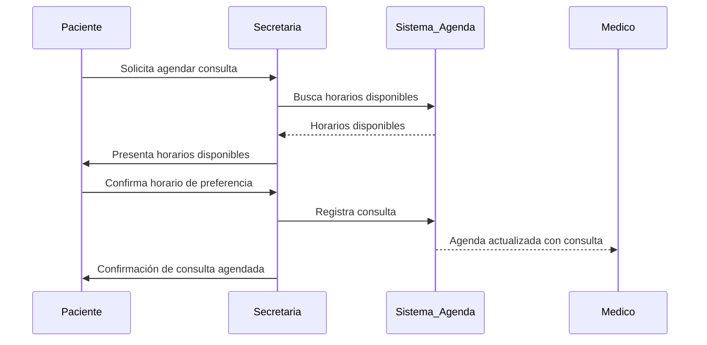

```mermaid
sequenceDiagram
participant Paciente
participant Secretaria
participant Sistema_Agenda
participant Medico

    Paciente->>Secretaria: Solicita agendar consulta
    Secretaria->>Sistema_Agenda: Busca horarios disponibles
    Sistema_Agenda-->>Secretaria: Horarios disponibles
    Secretaria->>Paciente: Presenta horarios disponibles
    Paciente->>Secretaria: Confirma horario de preferencia
    Secretaria->>Sistema_Agenda: Registra consulta
    Sistema_Agenda-->>Medico: Agenda actualizada con consulta
    Secretaria->>Paciente: Confirmación de consulta agendada
```
